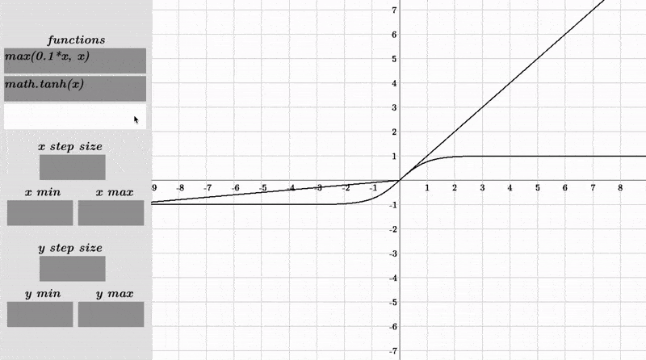

# Graphing Calculator (Pygame) 📈🐍

**Welcome to my Python Graphing Calculator!**

This graphing calculator is a tool that allows you to plot equations and functions on a 2D graph.

To use the calculator, you have to first run the program (make sure you have python and pygame installed!). Then, simply type an equation in the input field and press enter. You can also customize the graph by adjusting the x and y ranges.

Here is a demo:

